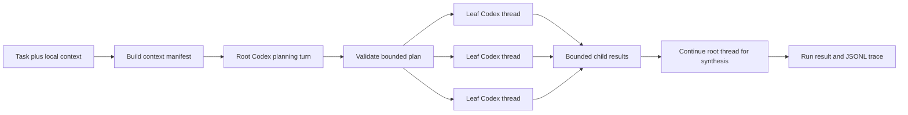

# Recursive Codex Core Spec

Status: first implementation contract
Version: 0.3
Date: 2026-08-19

## 1. Purpose

This document defines the smallest useful rcodex implementation.

The core version has one job: test whether externalized context plus bounded Codex decomposition improves results on large-context tasks compared with one direct Codex run.

It is deliberately not the final dynamic recursive runtime. Features not required to answer that question are listed in [Deferred Features](deferred-features.md). The complete target architecture remains in [Recursive Codex Runtime](recursive-codex-spec.md).

The source interpretation and minimal-version reasoning behind this contract are recorded in [Design Rationale](design-rationale.md).

The exact relationship to the pinned RLM source is recorded in [RLM Implementation Alignment](rlm-alignment.md). Core is an RLM-inspired feasibility slice, not an implementation-parity claim.

When this document conflicts with the full target specification, this document controls the first implementation.

### 1.1 Normative implementation boundary

The [Technology Stack Decision](tech-stack.md) controls language, SDK, packaging, dependencies, validation, testing, and engineering tooling. The following rules are mandatory for core:

- All Codex execution uses the stable Python package `openai-codex`.
- Use `AsyncCodex` because rcodex schedules concurrent leaf threads.
- Pin the package to an exact released version.
- Use the Codex runtime bundled and pinned by that SDK release.
- Use SDK thread objects for start, continuation, results, and any supported cancellation or usage operations.
- Use `Sandbox.read_only` for every core turn.
- Do not use the TypeScript SDK.
- Do not shell out to `codex exec` or `codex mcp-server` as the agent runtime.
- Do not implement a raw App Server JSON-RPC client.

If a desired capability is not exposed by the pinned Python SDK, that capability remains deferred until the SDK supports it or this architectural decision is explicitly revised.

## 2. Product boundary

Core rcodex accepts a task and one local directory, then runs one of two strategies:

- `direct`: one Codex thread answers using the external context.
- `two-level`: one Codex planner decomposes the task, bounded leaf Codex threads work in parallel, and the planner thread synthesizes their results.

The `two-level` strategy has a fixed maximum depth of one child layer:

```text
root planner, depth 0
├── leaf 1, depth 1
├── leaf 2, depth 1
└── leaf N, depth 1
root synthesis, depth 0
```

Leaf nodes cannot delegate. The root cannot add another child round after synthesis starts.

This tests a topology analogous to the default depth-1 RLM shape while using real Codex threads and native file/shell exploration instead of a model-generated Python REPL. The control flow is deliberately different: RLM can interleave context inspection and on-demand subcalls across several root iterations, while core precomputes one validated plan, runs one child wave, and synthesizes once. Dynamic model-directed equivalence begins with the deferred `recursive` strategy.

## 3. Why this is the minimum

The core version must prove five things before the project invests in arbitrary recursion:

1. Codex can explore an input that is not inserted wholesale into its prompt.
2. Codex can produce a useful, machine-validated decomposition plan.
3. Independent leaf Codex threads can run concurrently and return bounded evidence.
4. A root Codex thread can synthesize those results without context flooding.
5. The workflow improves a representative evaluation relative to direct Codex at an acceptable latency and usage cost.

MCP delegation, dynamic depth, durable resumption, and a trace UI do not need to exist to answer these questions.

## 4. Core workflow



### 4.1 Phase A — Context manifest

The controller scans the requested context directory and writes:

```text
<state-dir>/runs/<run-id>/context-manifest.json
```

The manifest has a versioned envelope and ordered entries:

```json
{
  "schema_version": "1.0",
  "context_root": "/resolved/read-only/path",
  "entries": [
    {
      "id": "file_001",
      "relative_path": "src/main.py",
      "bytes": 4217,
      "sha256": "...",
      "media_type": "text/x-python",
      "line_count": 133
    }
  ]
}
```

Core rules:

- Resolve and validate the context root before starting Codex.
- Include regular UTF-8 text files, source code, Markdown, JSON, JSONL, CSV, and TSV.
- Skip binary files, every symlink, special files, unreadable files, `.git`, `.rcodex`, and configured ignore patterns.
- Sort entries by normalized relative path for deterministic plans and tests.
- Use normalized POSIX-style relative paths in schemas on every supported platform.
- Enforce configured entry-count and total-byte scan limits before starting Codex.
- Do not copy file bodies into the run directory or model prompt.
- Give Codex the context root and manifest path. Codex reads relevant files with its native tools.

The core version supports one context directory. Single-file convenience, multiple roots, and content-addressed storage are deferred.

### 4.2 Phase B — Root planning turn

Start one Codex thread with:

- the selected model and reasoning effort;
- current working directory set to the context root;
- `Sandbox.read_only`;
- built-in subagent delegation disabled;
- no rcodex MCP tools;
- the task, manifest path, child limit, and required plan schema.

The planner returns:

```json
{
  "schema_version": "1.0",
  "coverage_summary": "How the subtasks cover the request",
  "subtasks": [
    {
      "id": "subtask_01",
      "task": "Inspect the public API changes",
      "context_refs": ["file_001", "file_019"]
    }
  ]
}
```

Validation rules:

- `subtasks` contains between 1 and `max_children` items.
- IDs are unique and match a conservative identifier pattern.
- Tasks are non-empty and length-limited.
- Every context reference resolves inside the manifest.
- Context references are navigation hints, not access-control boundaries; every core node can read the full context directory.
- Unknown properties are rejected.
- The serialized plan stays below `max_plan_bytes`.

If the first plan is invalid, the controller may continue the same root thread with one validation-error repair prompt. A second invalid plan fails the run. This is the only automatic model-output repair in core.

### 4.3 Phase C — Parallel leaf turns

For each validated subtask, start a fresh Codex thread with:

- `Sandbox.read_only`;
- delegation disabled;
- the root objective and bounded leaf task;
- the context root, manifest path, and referenced files;
- a required compact result schema.

Leaf result:

```json
{
  "schema_version": "1.0",
  "subtask_id": "subtask_01",
  "status": "succeeded",
  "summary": "Bounded findings",
  "evidence": [
    {
      "context_entry_id": "file_001",
      "path": "src/main.py",
      "line_start": 42,
      "line_end": 44,
      "description": "What this proves"
    }
  ],
  "uncertainties": []
}
```

Allowed leaf statuses are `succeeded`, `partial`, and `failed`.

Core behavior:

- Run at most `max_concurrency` leaf turns simultaneously.
- Preserve plan order when collecting results.
- Enforce one wall-clock timeout per leaf.
- Limit the bytes returned to the root.
- Treat an oversized leaf result as a failed leaf; do not silently truncate structured evidence.
- Treat invalid leaf JSON as a failed leaf.
- By default, retain only the validation error and a hash of invalid raw output; store bounded raw output only when diagnostic retention is explicitly enabled.
- Do not run a repair turn for a leaf.
- Do not retry model/task failures.
- Permit one retry only when the Codex runtime failed before accepting the turn.

### 4.4 Phase D — Root synthesis turn

Continue the original root thread with:

- the validated plan;
- ordered, size-bounded leaf results;
- explicit failed or timed-out leaf markers;
- the requested final response format.

The root may read the original context again to verify evidence. It may not create more leaves.

Final result:

```json
{
  "schema_version": "1.0",
  "run_id": "run_...",
  "strategy": "two-level",
  "status": "partial",
  "answer": "Final answer",
  "evidence": [],
  "children": {
    "requested": 4,
    "succeeded": 3,
    "failed": 1
  },
  "usage": {},
  "runtime": {
    "rcodex_version": "...",
    "python_version": "...",
    "openai_codex_version": "...",
    "bundled_codex_version": null,
    "model": "...",
    "reasoning_effort": "...",
    "prompt_template_version": "..."
  },
  "artifacts_path": "/resolved/state-dir/runs/run_..."
}
```

Allowed run statuses are `succeeded`, `partial`, `failed`, `cancelled`, and `timed_out`.

A valid final answer with any non-succeeded leaf is `partial`. Task-specific evaluators may score the answer separately but do not rewrite the runtime status.

## 5. Direct baseline

The `direct` strategy starts one read-only Codex thread with the same task, context root, manifest, model, reasoning effort, and run timeout. It does not plan or create children.

Direct and two-level runs must use comparable configuration so the evaluation does not attribute model or sandbox differences to decomposition.

The direct strategy is part of core, not an optional benchmark script.

## 6. User interface

Core CLI:

```bash
rcodex run \
  --task "Identify breaking API changes and cite the evidence" \
  --context ./repository \
  --strategy two-level \
  --max-children 4 \
  --max-concurrency 2 \
  --timeout 15m \
  --state-dir ./.rcodex \
  --output result.json
```

Required flags:

- `--task`
- `--context`
- `--strategy direct|two-level`

Optional core flags:

- `--model`
- `--reasoning-effort`
- `--max-children`
- `--max-concurrency`
- `--timeout`
- `--leaf-timeout`
- `--state-dir`
- `--output`
- `--include` and `--exclude`

The default state directory is `./.rcodex`, resolved from the invocation directory. If it overlaps the context root, the command fails with instructions to pass an external `--state-dir`.

Core does not implement `inspect`, `resume`, a daemon, a web API, or a trace UI.

Python entry point:

```python
result = await run(
    task="Identify breaking API changes.",
    context=Path("./repository"),
    strategy="two-level",
    state_dir=Path("./.rcodex"),
    config=config,
)
```

The API may remain internal until the CLI contracts stabilize.

## 7. Configuration and limits

Suggested defaults:

| Setting | Default | Enforcement |
| --- | ---: | --- |
| `max_children` | 4 | Hard before leaf creation |
| `max_concurrency` | 2 | Hard semaphore |
| `run_timeout_seconds` | 900 | Hard controller deadline |
| `leaf_timeout_seconds` | 300 | Hard controller deadline |
| `max_manifest_entries` | 100,000 | Hard during scan |
| `max_context_bytes` | 10 GiB | Hard during scan |
| `max_plan_bytes` | 32 KiB | Hard after planner response |
| `max_leaf_result_bytes` | 16 KiB | Hard before synthesis prompt |
| `max_final_result_bytes` | 128 KiB | Hard before persistence/output |
| `max_leaf_runtime_retries` | 1 | Hard |

Core records token usage when the SDK exposes it, but does not enforce token or dollar budgets. The result must not label these as hard limits.

The model is configurable. No model name is embedded into rcodex business logic.

## 8. Storage and observability

Core stores files only; it has no database.

```text
<state-dir>/runs/<run-id>/
  request.json
  context-manifest.json
  plan.json
  children/
    subtask_01.json
    subtask_01.raw.txt  # optional diagnostic retention
  result.json
  events.jsonl
```

Minimum JSONL events:

- `run.started`
- `manifest.created`
- `plan.started`
- `plan.validated` or `plan.failed`
- `leaf.started`
- `leaf.completed`, `leaf.failed`, or `leaf.timed_out`
- `synthesis.started`
- `run.completed`, `run.failed`, `run.cancelled`, or `run.timed_out`

Every artifact has `schema_version`. Every event has `event_schema_version`, a monotonically increasing run-local `sequence`, event ID, UTC timestamp, run ID, optional node/subtask ID, type, and a small payload.

Write JSON artifacts atomically using a temporary file in the destination directory followed by replacement. Append one bounded object per JSONL line and flush lifecycle transitions. `request.json` records the resolved configuration and runtime metadata defined in the [Technology Stack Decision](tech-stack.md).

Prompts, raw Codex events, shell output, SQLite projections, and a trace viewer are deferred. Raw invalid model output is stored only when needed for diagnosis.

## 9. Security boundary

Core is read-only analysis software.

Required controls:

- Every Codex turn uses `Sandbox.read_only`.
- The controller is the only writer to `<state-dir>/runs`.
- The resolved state directory and optional output path must be outside the resolved context root. Overlap is rejected before Codex starts.
- Built-in Codex subagents and unrelated MCP servers are disabled for the run.
- Web search and connector tools are disabled unless an explicit future strategy enables them.
- Context paths are resolved and containment-checked.
- The context root is an authorization input for rcodex scanning and evidence validation, not a confidentiality boundary for the local Codex sandbox.
- No API key, access token, or secret is written to prompts, manifests, or artifacts.
- Context contents are described as untrusted data in every node prompt.
- Input files are hashed before the run. A post-run integrity check confirms they did not change.

The implementation spike must verify network and tool disablement with the pinned SDK/runtime. If built-in delegation or unrelated MCP tools cannot be disabled, the core release is blocked because the controller could not enforce its child limit. `Sandbox.read_only` prevents writes but does not, by itself, promise that other host-readable paths are invisible. Weaker host-read or network isolation must be disclosed in run metadata, and confidential or security-sensitive evaluations require an external restricted environment.

Core makes no claim that model instructions alone prevent prompt injection.

## 10. Cancellation and cleanup

On `SIGINT` or deadline:

1. Stop admitting new leaves.
2. Cancel outstanding asyncio leaf tasks through their owning task group.
3. Interrupt active Codex turns when the SDK exposes interruption.
4. Exit the `AsyncCodex` context and wait for bounded cleanup.
5. Write terminal events and a `cancelled` or `timed_out` result.

Cleanup code may catch `asyncio.CancelledError` only to release resources and must then re-raise it.

Core is not resumable. A process crash may leave an incomplete run directory. The next invocation may mark such a run `abandoned`, but it does not continue it.

No terminal run may leave an rcodex-owned Codex or helper process active.

## 11. Failure rules

| Failure | Core behavior |
| --- | --- |
| Context path invalid | Fail before starting Codex. |
| State/output path overlaps context | Fail before starting Codex. |
| Manifest has no supported files | Fail before starting Codex. |
| Planner response invalid | One repair turn, then fail. |
| Plan exceeds child limit | Reject; do not silently truncate. |
| One leaf fails | Continue other leaves and synthesize a partial result. |
| One leaf times out | Continue other leaves and synthesize a partial result. |
| One leaf exceeds its result byte limit | Mark that leaf failed and synthesize a partial result. |
| Root synthesis fails | Run fails; retain plan and child artifacts. |
| Final result exceeds its byte limit | Run fails; retain bounded diagnostics. |
| An input hash changes during the run | Run fails integrity validation and records the affected paths. |
| Run deadline expires | Cancel active work and return `timed_out`. |
| User interrupts | Cancel active work and return `cancelled`. |

## 12. Minimal repository layout

```text
src/rcodex/
  __init__.py
  cli.py
  runner.py
  config.py
  context.py
  models.py
  storage.py
  codex_adapter/
    base.py
    sdk.py
  prompts/
    plan.md
    leaf.md
    synthesize.md
tests/
  unit/
  integration/
  fixtures/
docs/
```

Core stack summary:

- Python 3.11 or later;
- exactly pinned stable `openai-codex` Python SDK;
- Pydantic v2;
- standard-library `asyncio`, `argparse`, JSON, and filesystem primitives;
- no SQLite dependency in core;
- pytest, pytest-asyncio, Ruff, and mypy as development tools.

Do not add an MCP SDK, Agents SDK, FastAPI, task queue, database ORM, or UI dependency to core.

The complete decision, dependency policy, and quality gates are in [Technology Stack Decision](tech-stack.md).

## 13. Implementation sequence

### C0 — SDK spike

Prove with the pinned stable SDK:

- async thread start and continuation;
- SDK-managed authentication without an rcodex credential store;
- per-thread current working directory;
- read-only sandbox;
- disabling unrelated delegation, web, MCP, and connector tools;
- final response and thread ID capture;
- concurrent independent threads;
- deadline cancellation and process cleanup;
- available usage fields;
- model-output and structured-result behavior needed for strict Pydantic validation;
- concurrent use of one `AsyncCodex` instance, or the adapter fallback if that is unsupported.

Record unsupported controls explicitly. Do not build abstractions around assumed SDK behavior or bypass the Python SDK with a raw protocol client.

### C1 — Direct path

Implement manifest creation, one direct Codex turn, result files, JSONL events, and integrity checks.

### C2 — Two-level path

Implement planner schema validation, bounded leaf concurrency, ordered results, partial failures, and root synthesis.

### C3 — Evaluation gate

Run direct and two-level strategies over the same fixtures and publish correctness, latency, token usage, child count, and failure results.

Only after C3 should dynamic recursion begin.

## 14. Core acceptance criteria

Core is complete when:

- `rcodex run` supports `direct` and `two-level`.
- The corpus is not inserted wholesale into any model prompt.
- The plan is schema-validated and never creates more than the configured children.
- Leaf concurrency never exceeds its configured cap.
- Each leaf is a fresh, delegation-disabled Codex thread.
- The root synthesis continues the planning thread.
- Leaf results reach synthesis in deterministic plan order.
- Failed leaves produce a `partial` result rather than disappearing.
- All Codex work runs read-only and input hashes remain unchanged.
- State and output paths never overlap the context root.
- Cancellation and deadlines leave no rcodex-owned processes active.
- The run directory is sufficient to diagnose plan, child, and synthesis outcomes.
- Persisted artifacts are schema-versioned and written atomically.
- Runtime metadata records the versions and effective model configuration needed to explain the run.
- At least one long-context evaluation compares direct and two-level runs with the same model configuration.

## 15. Promotion gate

Do not implement arbitrary recursive MCP delegation merely because core works end-to-end.

Define task-specific metrics and promotion thresholds before running the evaluation. Use immutable fixtures, the same explicit model and reasoning configuration, and repeated trials where model nondeterminism could change the conclusion. Do not claim improvement from a single anecdotal run.

Promote to the next phase when a representative evaluation suite shows one of:

- materially higher correctness at a defined maximum usage increase;
- equivalent correctness at lower model usage;
- successful handling of inputs that direct Codex cannot process reliably;
- materially better evidence coverage on dense aggregation tasks.

If two-level execution does not beat the direct baseline, first improve partitioning, prompts, and evaluation quality. More recursion would otherwise amplify cost and failure modes without evidence of benefit.
