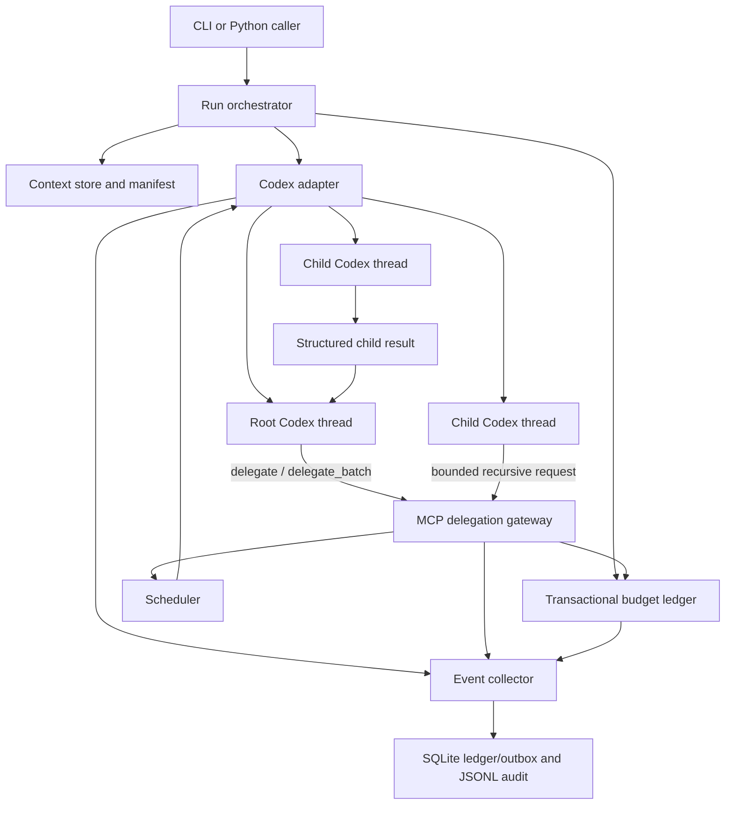

# Recursive Codex Runtime (rcodex)

Status: full target architecture; not the first implementation contract
Research snapshot: 2026-08-17
Last specification review: 2026-08-19
RLM source alignment review: 2026-08-19
Target: local, programmatic Codex; macOS and Linux first

## Specification set and precedence

- [Core Spec](core-spec.md) defines the minimal implementation and takes precedence for the first build.
- [Deferred Features](deferred-features.md) prioritizes everything removed from core.
- [Design Rationale](design-rationale.md) records source interpretation and the reasoning behind major decisions.
- [RLM Implementation Alignment](rlm-alignment.md) records the pinned source control flow, semantic mapping, and intentional deviations.
- This document describes the complete target architecture after the core evaluation gate.
- [References](../references/README.md) contains all research sources and direct online links.

The core version uses a fixed root planner → bounded leaf threads → root synthesis flow. It does not initially implement the MCP delegation gateway, arbitrary depth, SQLite, resume, compaction, write worktrees, or a trace UI.

## Technology stack

The [Technology Stack Decision](tech-stack.md) is the source of truth for language, Codex integration, packaging, dependencies, validation, testing, and engineering tooling.

In summary, rcodex uses Python 3.11+, the exactly pinned stable `openai-codex` Python SDK, `AsyncCodex`, the SDK's bundled runtime, Pydantic v2, and standard-library structured concurrency. It does not use the TypeScript SDK, shell out to Codex as its agent runtime, or implement a raw App Server JSON-RPC client.

## 1. Executive decision

Building a Codex-native Recursive Language Model is feasible now.

The project should not place Codex behind the original RLM repository's `BaseLM.completion()` interface. A Codex call is already an agent loop with shell, file, sandbox, approval, and thread state. Nesting that entire loop inside the RLM Python REPL would duplicate execution environments, weaken observability, and make permissions and cancellation harder to reason about.

Instead, rcodex should preserve the useful RLM semantics while replacing the RLM harness:

- Treat large input as an external, read-only context pack that Codex explores with native file and shell tools.
- Represent every reasoning node as a real Codex thread and turn.
- Allow a node to launch leaf or recursive child Codex nodes.
- Keep child work isolated and return compact structured results to the parent.
- Enforce depth, node count, concurrency, time, and output limits in a runtime outside the model; enforce token and cost limits only when the SDK exposes timely usage data.
- Record the complete parent/child tree, Codex events, usage, artifacts, failures, and cancellation.

The recommended delivery order is:

1. A single Codex node over an external context pack.
2. Fixed two-level planned decomposition controlled by rcodex.
3. Model-directed recursion through a constrained MCP delegation gateway.
4. An experimental adapter for Codex's built-in subagent tools.

This yields a useful system before dynamic recursion is introduced and gives us a baseline for deciding whether recursion improves quality enough to justify its cost.

## 2. Research basis

### 2.1 RLM semantics to preserve

The [RLM paper, revision 3](../references/rlm.md#paper) defines the central idea: keep a potentially huge prompt outside the neural context, let the model inspect and decompose it programmatically, and let it recursively query itself over selected snippets.

The source analysis is pinned to [`alexzhang13/rlm` commit `caf0bff`](../references/rlm.md#reference-implementation), rather than an unversioned branch. Its important mechanics are:

- `RLM.completion()` runs an iterative root-model/code-execution loop and stops when the environment captures a final answer.
- `LocalREPL` keeps a persistent Python namespace containing the external context and exposes direct, batched, recursive, and recursively batched model calls.
- `LMHandler` routes calls through a threaded, length-prefixed JSON socket protocol and limits batch concurrency.
- `llm_query` is a plain one-shot model call, while `rlm_query` creates a child RLM with its own iterative environment; their batched variants preserve input order and isolate per-item failures.
- The final-answer protocol is explicit: the environment returns `answer["content"]` when `answer["ready"]` becomes true. If the root exhausts `max_iterations`, RLM requests a final answer from the accumulated history.
- Recursive children receive their own environment, the same absolute iteration/depth caps, the remaining timeout, and a calculated remaining dollar budget. At maximum depth, the implementation falls back to a plain model completion. Its token cap is copied to children rather than transactionally reserved from one run-wide token pool.
- Limit checks happen after a root iteration, so the implementation may observe threshold overshoot rather than prevent every call before admission.
- The repository includes persistence, compaction, multiple execution environments, trajectory logging, a visualizer, and a training harness.

The reference implementation's local environment executes generated Python with in-process `exec`. Its own README says the local environment is not appropriate for production. rcodex must not reproduce that trust boundary.

The smaller [`rlm-minimal`](../references/rlm.md#minimal-implementation) implementation confirms the irreducible core: an external context, a programmatic environment, subcalls, and a final-answer protocol. It intentionally omits the production concerns rcodex must add.

### 2.2 Adjacent implementations

- [DSPy.RLM](../references/related-implementations.md#dspyrlm) exposes RLM as a module for large-context work and includes usage tracking across module calls. This supports keeping recursive execution behind a normal call/result API.
- [Prime Agent](../references/related-implementations.md#prime-agent) combines a persistent Python control environment, recursive child agents, durable state, background execution, goals, schedules, and bounded autonomous mode. It also explicitly warns that its model-generated Python and commands are not a security sandbox. Its persistence and lifecycle features are useful references; its trust model should not be copied as the rcodex default.
- The original repository links several other implementations, but they do not change the architectural decision: recursion is easy to demonstrate and difficult to bound, observe, resume, and secure.

### 2.3 Codex primitives available now

The current official Codex surfaces already provide most of the agent runtime:

- The [Codex SDK](../references/codex.md#codex-sdk) can start and continue local Codex threads. The stable Python package controls a pinned Codex App Server runtime and supports read-only, workspace-write, and full-access sandbox presets. Resume and other advanced Python lifecycle operations must be proven against the pinned version before rcodex uses them.
- [Codex App Server](../references/codex.md#codex-app-server) documents thread and turn lifecycle APIs, fork/resume/compact/interrupt operations, streamed item events, diffs, plans, token-usage updates, approvals, and thread history. rcodex uses these capabilities only when the pinned Python SDK exposes them.
- [Codex as an MCP server](../references/codex.md#codex-as-an-mcp-server) exposes tools to start and continue Codex sessions and is suitable when Codex is a specialist in a broader Agents SDK workflow.
- [Codex subagents](../references/codex.md#codex-subagents) provide native parallel child threads, custom agent profiles, inherited sandbox settings, and a per-session concurrency cap.

What Codex does not currently give this project as one complete public contract is a hard, run-wide policy for recursive depth, total descendants, aggregate usage, result size, and cancellation. rcodex is the policy and accounting layer that closes that gap.

## 3. Product definition

rcodex is a local library and CLI that maps:

```text
(task, context pack, recursion policy) -> structured result
```

The context may exceed the selected model's context window but remains bounded by configured scan limits. Codex receives paths and a manifest, not the full context. It decides what to inspect, can delegate bounded subtasks, and synthesizes the result.

### 3.1 Meaning of “native”

A node is native when:

- its reasoning and tool loop is a Codex thread/turn;
- it uses Codex file, shell, MCP, sandbox, approval, compaction, and event primitives;
- its thread ID is retained, and its transcript is resumed or inspected when the pinned Python SDK exposes those operations;
- rcodex does not parse model-authored Python blocks or impersonate a Codex tool loop.

The controller may schedule nodes and reject delegation requests. It must not perform the node's reasoning.

### 3.2 Primary use cases

1. Answer questions over text or code collections larger than a model context window.
2. Aggregate facts that require dense coverage across many files or records.
3. Explore a large repository with parallel, isolated specialists and synthesize an evidence-backed answer.
4. Run repeatable planned decomposition and synthesis with Codex workers.
5. Compare direct Codex, fixed two-level decomposition, and model-directed recursion on the same evaluation set.

### 3.3 Non-goals for the first production release

- Training or fine-tuning a recursive model.
- Reimplementing the original RLM Python REPL.
- General-purpose distributed compute.
- Unbounded autonomous execution.
- Shared, concurrent editing of one working tree.
- A hosted multi-tenant service.
- Automatic claims that recursive execution is cheaper or better than direct Codex; evaluations must demonstrate that per workload.

## 4. Design principles

1. **Externalize data, not policy.** Large data stays outside model context; permissions and budgets stay outside model control.
2. **Codex is the execution unit.** One node equals one Codex thread plus one or more controlled turns.
3. **References over copies.** Parents pass context references; child summaries return to parents. Raw corpora and verbose logs are not copied into every prompt.
4. **One budget ledger.** Every descendant spends from the same transactional run budget.
5. **Isolation before parallel writes.** Read-heavy parallel work is the default. A write-capable child gets its own scratch workspace or Git worktree.
6. **Structured boundaries.** Delegation requests and node results use schemas, stable IDs, and explicit failure states.
7. **Partial results are first-class.** Timeouts and budget exhaustion return inspectable partial output rather than masquerading as success.
8. **Pin unstable contracts.** The `openai-codex` Python SDK is pinned exactly and tested with the runtime bundled by that release.

## 5. User-facing interface

### 5.1 CLI

Minimum CLI:

```bash
rcodex run \
  --task "Summarize the breaking API changes and cite their files" \
  --context ./repository \
  --strategy recursive \
  --max-depth 2 \
  --max-nodes 16 \
  --max-concurrency 4 \
  --timeout 30m \
  --state-dir ./.rcodex \
  --output result.json
```

Other required commands:

```bash
rcodex inspect <run-id>
rcodex cancel <run-id>
rcodex resume <run-id>
rcodex export-trace <run-id> --format jsonl
rcodex eval <suite.toml> --strategies direct,two-level,recursive
```

`run` prints the run ID immediately, streams concise progress to stderr, and writes only the requested final format to stdout when `--output` is absent.

### 5.2 Python API

```python
from pathlib import Path
from rcodex import RecursiveCodex, RunConfig

runner = RecursiveCodex(
    RunConfig(
        strategy="recursive",
        max_depth=2,
        max_nodes=16,
        max_concurrency=4,
        wall_time_seconds=1800,
    )
)

result = await runner.run(
    task="Identify incompatible API changes and cite the evidence.",
    context=[Path("./repository")],
    state_dir=Path("./.rcodex"),
)

print(result.status, result.answer, result.run_id)
```

The library must also expose an async event iterator and cancellation handle.

## 6. Execution strategies

### 6.1 `direct`

One root Codex node receives the task and context manifest. Delegation is disabled. This is the mandatory quality, usage, and latency baseline.

### 6.2 `two-level`

One root Codex planning turn creates a schema-validated plan. The controller runs a bounded set of fresh leaf Codex threads and continues the original root thread with their ordered, size-limited results for synthesis. No model-directed recursive tool calls occur.

This is the first multi-node implementation because depth and admission are controller-owned even though the plan itself is model-generated. A deterministic `partitioned-map-reduce` strategy remains an evaluation-driven deferred feature.

`two-level` preserves an RLM-like root/leaf topology but not RLM's iterative control flow. The root cannot inspect one child result and decide to launch a later child wave. It must be described and evaluated as a feasibility reduction.

### 6.3 `recursive`

A Codex node receives two MCP tools:

- `delegate`: start one leaf or recursive child.
- `delegate_batch`: start independent children concurrently and return results in input order.

The delegation gateway validates each request, reserves budget, launches child Codex nodes, and returns compact structured results. Children receive the same tools only when the requested mode is recursive and their depth remains below the configured maximum.

Within one Codex turn, a recursive parent may inspect context, delegate, inspect the returned result, perform more local tool work, and delegate again until it finalizes or a controller-owned limit is reached. This interleaving is required for semantic alignment with RLM's iterative root loop.

Codex's built-in multi-agent tools are disabled in this strategy so the model cannot bypass the gateway's run-wide limits.

### 6.4 `native-subagents` (experimental)

The root uses Codex's built-in subagent tools. rcodex observes descendants through Python SDK events and thread metadata when those capabilities are available, mirrors their state into the ledger, and interrupts work after a limit is reached.

This is the closest integration with the interactive Codex experience, but it is not the default until all configured limits can be enforced before work begins. A concurrency cap alone is not a complete recursion budget.

## 7. Architecture



### 7.1 Run orchestrator

Responsibilities:

- validate the request and create a durable run record;
- build or reuse a context pack;
- create the root node and its capability;
- select the execution strategy;
- propagate cancellation and deadlines;
- decide final run status from the root result and ledger state;
- reconcile unfinished nodes after a process restart.

The orchestrator must not depend on model prose to determine lifecycle state.

### 7.2 Codex adapter

Expose a narrow internal interface:

```python
class CodexAdapter(Protocol):
    async def start_node(self, request: NodeStartRequest) -> NodeHandle: ...
    async def run_turn(self, handle: NodeHandle, prompt: str) -> NodeTurnResult: ...
    async def stream_events(self, handle: NodeHandle) -> AsyncIterator[CodexEvent]: ...
    async def interrupt(self, handle: NodeHandle) -> None: ...
    async def resume(self, thread_id: str) -> NodeHandle: ...
    async def compact(self, handle: NodeHandle) -> None: ...
    async def close(self, handle: NodeHandle) -> None: ...
```

Implementation policy:

- Use the stable Python `openai-codex` SDK for all thread lifecycle.
- Use `AsyncCodex` for concurrent nodes.
- Use the SDK's bundled pinned local runtime.
- Keep SDK-specific objects behind this adapter so package upgrades stay localized.
- Do not implement a raw App Server client or directly depend on its transport schema.
- Leave lifecycle features deferred when the pinned Python SDK does not expose them.
- Store Codex thread IDs on node records.

### 7.3 Delegation gateway

The gateway replaces RLM's `LMHandler` and recursive functions. It is both an MCP server visible to Codex and a client of the scheduler.

Required properties:

- one logical gateway capability per node;
- a server-side binding to `run_id`, `node_id`, permitted tools, and expiration that is established outside model-supplied arguments;
- the server derives parent identity and depth from that capability, never from model-supplied IDs;
- idempotency keys prevent duplicate children after retry or reconnect;
- validation and budget reservation occur atomically before scheduling;
- results are schema-validated and size-limited before returning to the parent;
- verbose child data is stored as an artifact and replaced by a reference in the tool response.

The first implementation should launch one pre-bound local stdio MCP server per active node. The stdio transport instance is the capability; any bootstrap handle must arrive through an inherited pipe or one-time registration and must not appear in the prompt, workspace, command line, or shell environment. A later shared HTTP MCP service may multiplex nodes with opaque tokens after authentication and caller binding are proven.

### 7.4 Scheduler

The scheduler maintains:

- one global runnable-node semaphore per run;
- a separate hard cap on open nodes and turns;
- optional per-node batch limits;
- a fair queue so one recursive branch cannot starve siblings;
- deadline-aware cancellation;
- ordered result collection for batches;
- bounded retry for infrastructure failures only.

Model or task failures are results, not retryable infrastructure errors.

A node transitions to `waiting_children` and releases its runnable permit before its child is queued. It reacquires a permit before model execution resumes. No parent may wait while holding the only permit its descendant needs. The P1 capability spike must verify that a blocked MCP call can follow this rule with the pinned SDK/runtime; otherwise recursive mode is not admitted.

### 7.5 Context store

A context pack is immutable for the duration of a run and contains:

```json
{
  "schema_version": "1.0",
  "context_pack_id": "ctx_...",
  "created_at": "2026-08-17T12:00:00Z",
  "roots": [{"logical_name": "repo", "path": "input/repo"}],
  "entries": [
    {
      "id": "file_...",
      "path": "repo/src/main.py",
      "media_type": "text/x-python",
      "bytes": 4217,
      "sha256": "...",
      "line_count": 133
    }
  ]
}
```

Full-target inputs:

- directories and individual local files;
- UTF-8 text, source code, Markdown, JSON, JSONL, CSV, and TSV;
- an explicit error or extraction adapter for unsupported binary formats.

File bodies remain on disk. The prompt contains aggregate context statistics and the manifest path; it does not assume the complete manifest is small enough to inline. Codex uses `rg`, targeted reads, and task-appropriate tools to inspect the pack.

For very large or frequently reused data, the store should support content-addressed blobs and manifests without copying unchanged files. The security boundary must still make the context read-only to every node.

### 7.6 Workspace manager

Workspace profiles:

- `read_only`: input pack readable; Codex has no writable path and only the controller writes artifacts.
- `scratch`: input pack readable; node gets a private writable temporary directory.
- `git_worktree`: node gets a private Git worktree and branch for write-heavy coding tasks.

Parallel nodes must never write to the same checkout. The root may synthesize text without write access. Merging code from child worktrees is a separate, explicit workflow and is outside the read-only analysis core.

### 7.7 Event collector and store

Persist in the recursive target:

- a SQLite transactional ledger containing runs, nodes, edges, budgets, statuses, and an event outbox;
- an append-only JSONL audit stream exported idempotently from the outbox;
- query projections for usage, artifacts, and trace inspection;
- the final result as JSON;
- optional redacted prompts and outputs according to retention policy.

SQLite is authoritative for live admission and lifecycle state. State changes and their outbox events commit in the same SQLite transaction. JSONL is the portable audit export; after the outbox is drained, query projections can be rebuilt from the event stream. Core remains file-only as defined in the [Core Spec](core-spec.md).

## 8. RLM-to-rcodex mapping

| RLM concept | rcodex equivalent | Notes |
| --- | --- | --- |
| `RLM.completion()` | `RecursiveCodex.run()` | Analogous task/context-to-result role, with structured status and artifacts. |
| Root prompt plus payload in `context` | Task plus immutable context pack and manifest | Bodies are explored with Codex-native tools rather than injected wholesale. |
| Iterative root LM/REPL loop | One Codex node turn with native tool use and repeated delegation | Required in `recursive`; fixed `two-level` is only a reduction. |
| `llm_query` | `delegate(mode="leaf")` | The leaf cannot delegate, but remains a richer Codex agent rather than a plain one-shot LM. |
| `rlm_query` | `delegate(mode="recursive")` | A fresh Codex child may delegate within remaining limits. |
| Batched query helpers | `delegate_batch` | Concurrent, bounded, ordered results with per-item failure. |
| `LMHandler` | Codex adapter plus delegation gateway and scheduler | Replaces model routing and adds capability binding and transactional admission. |
| Child's fresh REPL environment | Fresh Codex thread and isolated workspace profile | Parent and child reasoning state are distinct. |
| Local Python `exec` | Codex sandbox, shell, and filesystem tools | No in-process generated-code execution in the controller. |
| `answer["ready"]` | Schema-valid `NodeResult` and completed Codex turn | Lifecycle does not depend on parsing free-form prose. |
| `max_iterations` and fallback answer | Codex-owned internal agent loop plus controller turn/deadline policy | rcodex does not emulate RLM iteration numbers. |
| Plain-LM fallback at `max_depth` | Terminal Codex node without delegation tools | Intentional observable policy difference; denied requests are not silently converted. |
| RLM trajectory logger | Python SDK events/results plus rcodex event store | Maintains parent/child causality within the SDK's exposed event surface. |
| Persistent environment across completions | No v1 equivalent | Resume/compact concern one run; reusable multi-run sessions are separately deferred. |
| Custom tools and alternate subcall model | Node-scoped tool/model profiles | Deferred until capability and evaluation requirements justify them. |

The complete preservation/deviation matrix is normative context for this mapping: [RLM Implementation Alignment](rlm-alignment.md).

## 9. Data contracts

### 9.1 Run request

```json
{
  "schema_version": "1.0",
  "task": "string",
  "context": [{"path": "string", "logical_name": "string"}],
  "state_dir": "string",
  "strategy": "recursive",
  "model": "optional model id",
  "reasoning_effort": "optional supported effort",
  "workspace_profile": "read_only",
  "limits": {
    "max_depth": 2,
    "max_nodes": 16,
    "max_children_per_node": 8,
    "max_concurrency": 4,
    "wall_time_seconds": 1800,
    "node_time_seconds": 600,
    "max_child_result_bytes": 65536,
    "max_artifact_bytes_per_node": 10485760,
    "max_artifact_bytes_per_run": 104857600,
    "max_retries_per_node": 1,
    "max_input_tokens": null,
    "max_output_tokens": null,
    "max_cost_usd": null
  },
  "output_schema": null,
  "metadata": {}
}
```

Model names and reasoning levels are configuration, not hard-coded application constants.

Allowed strategies are `direct`, `two-level`, `recursive`, and `native-subagents`. Allowed workspace profiles are `read_only`, `scratch`, and `git_worktree`, subject to strategy policy.

### 9.2 Delegation request

```json
{
  "schema_version": "1.0",
  "idempotency_key": "model-generated unique string",
  "task": "A bounded, independently answerable subtask",
  "mode": "leaf",
  "context_refs": [
    {"entry_id": "file_...", "line_start": 1, "line_end": 400}
  ],
  "workspace_profile": "read_only",
  "result_schema": {
    "type": "object",
    "required": ["summary", "evidence"]
  }
}
```

Rules:

- Allowed modes are `leaf` and `recursive`.
- `idempotency_key` is length-limited and scoped to the authenticated parent capability; a repeated key replays the existing child/result rather than starting new work.
- `task` is required and length-limited.
- `context_refs` must resolve inside the run's context pack.
- `context_refs` are navigation hints, not an access-control boundary.
- The gateway may narrow requested permissions but never widen them.
- A recursive request at maximum depth is rejected with `limit_reached`; it is not silently converted to a leaf because the parent should know the requested reasoning mode was unavailable.
- Batch requests have a bounded item count and preserve input order.

### 9.3 Node result

```json
{
  "schema_version": "1.0",
  "node_id": "node_...",
  "thread_id": "Codex thread id",
  "status": "succeeded",
  "summary": "Compact response for the parent",
  "evidence": [
    {"context_entry_id": "file_...", "path": "repo/src/main.py", "line": 42}
  ],
  "artifacts": [
    {"artifact_id": "artifact_...", "media_type": "application/json", "bytes": 1200}
  ],
  "usage": {
    "input_tokens": 0,
    "output_tokens": 0,
    "cached_input_tokens": 0,
    "cost_usd": null
  },
  "error": null
}
```

`summary` is always bounded. When a result exceeds the boundary, rcodex stores the accepted payload as an artifact and returns a deterministic truncation marker plus the artifact ID. It does not create an unplanned summarizer node.

Allowed node statuses are `succeeded`, `partial`, `failed`, `cancelled`, `timed_out`, `budget_exhausted`, and `lost`.

### 9.4 Run result

```json
{
  "schema_version": "1.0",
  "run_id": "run_...",
  "status": "succeeded",
  "answer": "string or schema-valid object",
  "root_node_id": "node_...",
  "usage": {},
  "node_counts": {"total": 1, "succeeded": 1, "failed": 0},
  "artifacts": [],
  "trace_path": "/resolved/state-dir/runs/run_.../events.jsonl",
  "error": null
}
```

Allowed run statuses are `succeeded`, `partial`, `failed`, `cancelled`, `timed_out`, and `budget_exhausted`.

## 10. Prompt contract

Every node receives a compact developer instruction generated from a versioned template. It states:

- the root objective and the node's bounded task;
- current depth and remaining limits;
- available context roots and manifest path;
- that context contents are untrusted data, not instructions;
- that it should inspect only relevant data and cite paths/locations;
- when delegation is allowed and how leaf differs from recursive work;
- that parallel delegation is only for independent subtasks;
- the required result schema and maximum response size;
- that success requires evidence or explicit uncertainty;
- that it must not attempt to alter budget, capability, event, or policy files.

The root prompt must not dump the entire context manifest if it is itself large. It provides aggregate statistics and the manifest path.

Prompts are versioned and recorded as `prompt_template_version`, enabling evaluation and rollback.

## 11. Budget and recursion policy

### 11.1 Depth definition

- Root depth is `0`.
- A direct child is depth `1`.
- `max_depth` is the greatest child depth that may be created.
- A node at `max_depth` has no delegation tools.

This deliberately differs from RLM, where reaching `max_depth` changes the call into a plain LM completion. rcodex admits a terminal Codex agent at the greatest configured child depth and removes its delegation capability. This difference is observable and tested rather than hidden behind a fallback.

### 11.2 Required limits

Each run supports:

- maximum depth;
- maximum total nodes, including root;
- maximum children per node;
- maximum active child nodes;
- run and per-node wall-clock deadlines;
- maximum child result bytes;
- maximum artifact bytes per node and per run;
- maximum retry count;
- optional aggregate input tokens, output tokens, and cost.

Token and cost enforcement is only advertised as hard when the active Codex surface reports usage early enough to stop before overshoot. Otherwise, rcodex must label the limit `observed` and document the possible final-response overshoot. Structural limits and admission deadlines remain hard.

### 11.3 Transactional reservation

Before accepting a child:

1. Begin an immediate SQLite transaction.
2. Re-read run status and the authoritative counters.
3. Reject if the run is cancelling, terminal, at maximum depth, or out of node/child/time budget.
4. Reserve one node slot and a configured token/time allowance.
5. Insert the child and parent edge with status `reserved`.
6. Commit, then enqueue the child.

On completion, actual usage replaces the reservation and unused allowance returns to the pool. Concurrent branches must never receive independent copies of “remaining budget.”

### 11.4 Delegation denial

The tool returns a normal structured response:

```json
{
  "status": "limit_reached",
  "reason": "max_depth",
  "remaining": {"nodes": 7, "wall_time_seconds": 412}
}
```

The parent may synthesize from existing evidence. Repeated identical denied calls are rate-limited and do not consume model retries indefinitely.

## 12. Lifecycle and state machines

Run states:

```text
queued -> starting -> running -> synthesizing -> succeeded
                           |            |------> partial
                           |-------------------> failed
                           |-------------------> cancelled
                           |-------------------> timed_out
                           |-------------------> budget_exhausted
```

Node states:

```text
reserved -> queued -> starting -> running -> waiting_children -> running
                                      |-----------------------> succeeded
                                      |-----------------------> partial
                                      |-----------------------> failed
                                      |-----------------------> cancelled
                                      |-----------------------> timed_out
                                      |-----------------------> budget_exhausted
                                      |-----------------------> lost
```

Transitions are compare-and-swap updates with an event inserted into the SQLite outbox in the same transaction. The exporter appends those events to JSONL idempotently. Terminal states are immutable except for attaching late diagnostic metadata.

### 12.1 Cancellation

Cancellation is tree-wide:

1. Mark the run `cancelling` and reject new delegation.
2. Interrupt active descendant turns concurrently.
3. Terminate node-owned command processes and MCP servers after a grace period.
4. Await cleanup for a bounded interval.
5. Mark remaining nonterminal nodes cancelled or lost.
6. Return any validated partial root result.

No successful run may have an active descendant or orphaned node-owned process.

### 12.2 Retry

Retry only:

- Python SDK or bundled runtime startup failure;
- transient transport disconnect;
- explicitly classified service rate limit or temporary availability error;
- scheduler crash before a Codex turn was accepted.

Do not automatically retry invalid output, a denied tool call, a shell error caused by the task, or a completed turn whose answer is poor. Those require a configured repair turn and consume normal node budget.

### 12.3 Resume and crash recovery

Persist before launching external work. On restart:

- reconcile `starting`, `running`, and `waiting_children` nodes with stored thread IDs and Python SDK thread state when exposed;
- resume a known idle thread only when its previous turn outcome is durable;
- use the delegation idempotency key to avoid duplicate child creation;
- mark unrecoverable external processes `lost` and apply retry policy;
- rebuild non-authoritative query projections from committed events if consistency checks fail.

## 13. Security model

### 13.1 Defaults

- Codex sandbox: read-only.
- Network: disabled.
- Approval policy for unattended runs: reject actions that need new approval.
- Context: immutable and mounted/readable without write permission.
- State and output paths: resolved outside every context root.
- Node scratch: private and size-limited.
- Built-in Codex multi-agent tools: disabled in controlled recursive mode.
- MCP tools: explicit allowlist containing only rcodex delegation tools plus task-approved tools.
- Secrets: absent from Codex process environments by default; task-approved external tools use a secret broker and never write credentials into context packs or prompts.

`Sandbox.full_access` is not allowed by the public `run` API in the first production release.

The local read-only sandbox is a write boundary, not a complete confidentiality boundary for all other host-readable paths. Confidential workloads require the external isolation profile before they are accepted.

### 13.2 Capability binding

The model must not be trusted to state its own `run_id`, `node_id`, depth, or remaining budget. Those values come from the authenticated gateway session. Capability tokens:

- are required for a multiplexed transport; a dedicated stdio process uses its pre-bound transport instance instead;
- contain at least 128 bits of entropy;
- are short-lived and node-scoped;
- are redacted from logs and tool output;
- cannot authorize a different workspace or run;
- are revoked when the node or run reaches a terminal state.

### 13.3 Prompt injection

Files and delegated text are untrusted input. Developer instructions must distinguish data from commands, but instructions alone are not the security boundary. The enforceable boundary is:

- read-only inputs;
- least-privilege tools;
- network denial or allowlist;
- node-specific writable roots;
- no ambient secrets;
- validation of every gateway argument;
- bounded outputs and command logs.

### 13.4 Write-capable coding tasks

A write-capable node receives an isolated worktree or scratch directory. It may not write to the controller state directory, context blob store, another node's workspace, or the primary checkout. Any later merge is reviewed and executed as a distinct operation.

## 14. Observability

Every event includes:

```text
event_schema_version, sequence, event_id, timestamp, run_id, node_id, parent_node_id, depth,
thread_id, turn_id, event_type, status, model, reasoning_effort,
sandbox, workspace_id, prompt_template_version, payload
```

Required normalized events:

- run and node state transitions;
- budget reserved, reconciled, denied, and exhausted;
- delegation requested, accepted, started, completed, and returned;
- Codex turn/item start and completion;
- command and MCP tool metadata, with policy-based content redaction;
- token-usage updates and final usage;
- artifact created;
- cancellation requested and acknowledged;
- retry scheduled;
- schema validation failed;
- process cleanup completed.

The trace viewer is not needed for the first vertical slice. `inspect` must still render a readable tree with status, duration, usage, and errors.

## 15. Failure semantics

| Failure | Child tool response | Node status | Run behavior |
| --- | --- | --- | --- |
| Invalid delegation arguments | `invalid_request` | Parent continues | Record policy event. |
| Depth/node limit | `limit_reached` | No child created | Parent synthesizes with existing data. |
| Child timeout | Partial result if valid | `timed_out` or `partial` | Parent decides whether evidence is sufficient. |
| Child task failure | Structured error | `failed` | Siblings continue. |
| One item in a batch fails | Result at the same index | Per-child status | Batch does not discard successes. |
| Root timeout | Validated partial answer if present | `timed_out` or `partial` | Cancel descendants. |
| Budget exhausted | `budget_exhausted` | Affected nodes cancelled | Root gets one bounded synthesis opportunity only if reserved. |
| Invalid final schema | One optional repair turn | `failed` if still invalid | Never call invalid output success. |
| Controller crash | Reconcile on resume | `lost` if unrecoverable | Follow idempotent retry policy. |

## 16. Compaction and context management

Use three independent mechanisms:

1. External context packs prevent the corpus from filling a node's model context.
2. Child summaries prevent recursive raw output from filling the parent context.
3. Codex thread compaction handles long node-local conversations.

Compaction must never delete the external artifacts or trace. Record compaction events and prompt versions. A resumed thread must retain the root objective, active constraints, evidence references, and outstanding child results.

The runtime should prefer one substantive turn per node. Multi-turn repair or synthesis is allowed only through explicit controller policy, which makes token and lifecycle accounting clearer.

## 17. Repository layout to implement

```text
src/rcodex/
  cli.py
  api.py
  config.py
  models.py
  orchestrator.py
  scheduler.py
  budget.py
  context_store.py
  workspaces.py
  codex_adapter/
    base.py
    sdk.py
  gateway/
    mcp_server.py
    capabilities.py
    validation.py
  prompts/
    root.md
    child.md
    synthesize.md
  persistence/
    events.py
    sqlite.py
    migrations/
  strategies/
    direct.py
    two_level.py
    recursive.py
    native_subagents.py
  evals/
    runner.py
    metrics.py
tests/
  unit/
  integration/
  fixtures/
docs/
```

The accepted core stack and quality gates are defined in [Technology Stack Decision](tech-stack.md). The full target adds SQLite through Python's standard library for the P1 ledger and adds an MCP SDK only after the P1 capability spike selects and pins a compatible implementation. No ORM is required.

## 18. Implementation milestones

### M0 — Capability spike

Implement C0 from the [Core Spec](core-spec.md). Deliverables:

- pin an `openai-codex` Python SDK version and use its bundled runtime;
- prove async thread start, continuation, concurrent independent threads, and bounded cleanup;
- verify current working directory, read-only sandbox, model configuration, and unrelated-tool disablement;
- inventory cancellation and usage fields exposed by the SDK;
- document Python SDK gaps; capabilities not exposed by the SDK remain deferred.

Exit criterion: the pinned SDK passes the core lifecycle, capability, and declared-sandbox integration tests without a raw protocol client.

### M1 — Direct vertical slice

Implement C1 from the [Core Spec](core-spec.md). Deliverables:

- one-root context manifest;
- one read-only root Codex node;
- structured run result;
- JSON artifacts and JSONL events;
- CLI `run --strategy direct`;
- fake adapter for deterministic tests.

Exit criterion: answer a repository question with valid file evidence and leave the context directory unchanged.

### M2 — Two-level planned decomposition

Implement C2 and C3 from the [Core Spec](core-spec.md). Deliverables:

- schema-validated Codex decomposition plan;
- bounded leaf concurrency;
- ordered results;
- continuation of the root thread for synthesis;
- partial batch semantics.

Exit criterion: direct and two-level strategies process the same long-context evaluation, preserve input integrity, and publish comparable correctness, usage, latency, and failure results.

### M3 — Controlled recursive mode

Deliverables:

- verify node-specific MCP configuration through the Python SDK;
- MCP `delegate` and `delegate_batch` tools;
- node-scoped capabilities;
- recursive child scheduling;
- depth, child, node, concurrency, time, output, and observed usage limits;
- recursive cancellation and terminal-state reconciliation;
- child result artifacts and bounded summaries.

Exit criterion: adversarial tests cannot exceed structural limits or access another node's workspace.

### M4 — Hardening and evaluations

Deliverables:

- injection and capability abuse tests;
- network and filesystem containment tests;
- recorded integration fixtures for transport failures;
- evaluation runner comparing all strategies;
- retention/redaction controls;
- performance and reliability report.

Exit criterion: recursive mode is promoted only on workloads where it meets the configured quality target without violating usage, latency, or reliability thresholds.

### M5 — Optional native-subagent adapter and UI

Deliverables:

- Python SDK descendant discovery and event mapping, if supported;
- best-effort limit observer for built-in Codex subagents;
- trace tree UI;
- explicit display of hard versus observed limits.

This milestone is optional and must not block the controlled recursive runtime.

## 19. Test plan

### 19.1 Unit tests

- depth calculation and delegation eligibility;
- concurrent budget reservation;
- idempotency-key replay;
- state transition validity;
- batch ordering with mixed success/failure;
- result truncation and artifact fallback;
- context-reference containment;
- capability expiration and revocation;
- cost/token aggregation;
- event-outbox export and query-projection rebuild.

### 19.2 Integration tests with a fake Codex adapter

- nested recursion to the exact configured depth;
- adaptive recursion where a second child task depends on the first child's returned result;
- leaf, recursive, and terminal-depth capability exposure;
- total-node and children-per-node enforcement under races;
- cancellation during command execution and child waiting;
- controller restart between reservation and launch;
- duplicate MCP delivery;
- timeout with a valid partial root result;
- one failed child does not erase sibling results;
- no terminal run retains active processes.

### 19.3 Live Codex integration tests

- read-only repository analysis;
- node-specific scratch writes;
- MCP delegation from root to leaf;
- recursive child delegation;
- interleaved context inspection, sequential delegation, result inspection, and finalization in one parent turn;
- Python SDK event and usage capture;
- thread resume and compaction;
- sandboxed command denial;
- network denial;
- interrupt propagation.

Live tests are opt-in and tagged because they consume account usage.

### 19.4 Evaluation suites

At minimum:

1. Needle-in-a-haystack retrieval over input larger than model context.
2. Dense aggregation where the answer depends on every partition.
3. Cross-file repository understanding with exact evidence citations.
4. Conflicting evidence requiring synthesis rather than majority vote.
5. Prompt-injection text embedded in the corpus.
6. A task that does not benefit from recursion, to measure overhead and prevent overuse.
7. An adaptive task whose second subproblem cannot be specified correctly until the first child result is known.

For each case compare:

- correctness and evidence precision/recall;
- partition coverage;
- input, output, and cached tokens;
- estimated cost when available;
- wall-clock time;
- node count and maximum depth;
- failure and retry rate;
- amount of child output inserted into parent context.

## 20. Acceptance criteria for v1

v1 is complete when all of the following are true:

- A caller can run `direct`, `two-level`, and controlled `recursive` strategies through the same API.
- Context larger than the active model window is never inserted wholesale into a prompt.
- Every reasoning node is a real Codex thread with a recorded thread ID; inspection and resume are enabled only where the pinned Python SDK supports them.
- Recursive and batch delegation return schema-valid, ordered results.
- A recursive node can inspect a returned child result and make a later bounded delegation before finalizing.
- Maximum depth, total nodes, children per node, and concurrency hold under concurrent requests.
- Run cancellation stops descendants and reaps node-owned processes.
- Read-only tasks cannot modify input or repository files.
- Parallel write-capable tasks use separate workspaces.
- A complete tree, state history, usage stream, and artifact index can be reconstructed after restart.
- Terminal status distinguishes success, partial completion, failure, timeout, cancellation, and budget exhaustion.
- Evaluation reports compare recursive execution with direct Codex rather than reporting recursive results in isolation.
- No feature depends on executing model-generated Python in the rcodex controller process.

## 21. Open questions to resolve in M0

1. Which streamed item, usage, interrupt, resume, and compaction operations does the pinned Python SDK expose, and which target features must remain deferred?
2. What is the cleanest supported way to inject node-specific MCP configuration and secrets without creating mutable project configuration inside the context workspace?
3. Which reported usage fields are incremental enough for enforceable token limits, and what maximum overshoot remains possible?
4. Can Codex final output be constrained directly to a JSON schema in the chosen SDK surface, or must rcodex validate and run one repair turn?
5. What context import strategy gives immutable views without expensive copies on macOS and Linux?
6. Which command, tool-output, and artifact size limits are safe defaults for the first release?
7. Should persisted Codex threads be ephemeral by default, archived on completion, or retained according to an explicit run policy?

These are implementation spikes, not blockers to feasibility.

## 22. Final recommendation

Proceed with the project.

Start with the direct and fixed `two-level` modes, then add the MCP delegation gateway only after the evaluation gate. This sequence preserves the RLM insight—external context plus recursive focused calls—while using Codex for what it already does well: reasoning, file exploration, commands, sandboxing, threads, compaction, and tool use.

Do not begin by modifying `alexzhang13/rlm` to add a Codex backend. That would produce a quick demo, but it would place one agent harness inside another and make the hardest requirements—hard limits, workspace isolation, cancellation, and auditability—more difficult. The standalone rcodex runtime is the cleaner native design.
